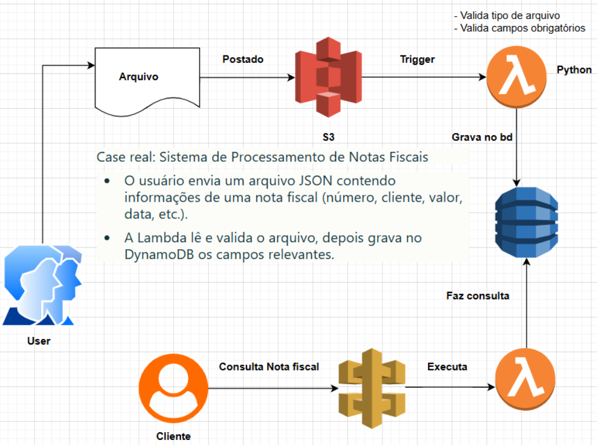

# Desafio: Processamento de Notas Fiscais com Localstack e AWS Serverless

Este projeto implementa um pipeline de backend serverless para o processamento de notas fiscais, utilizando Localstack para simular o ambiente da AWS localmente. A solução é projetada para receber arquivos JSON de notas fiscais, processá-los e armazená-los em um banco de dados NoSQL.

## Visão Geral do Projeto

O objetivo principal era construir e testar uma arquitetura orientada a eventos, onde o upload de um arquivo em um bucket S3 dispara automaticamente o processamento e armazenamento dos dados. O uso do Localstack foi fundamental para permitir o desenvolvimento e teste de toda a infraestrutura na nuvem sem custos e com um ciclo de feedback rápido.

## Arquitetura da Solução

O fluxo de dados principal segue o seguinte caminho:

1.  **Upload**: Um arquivo `.json` contendo uma ou mais notas fiscais é enviado para um bucket no S3.
2.  **Trigger**: O S3 detecta a criação do novo objeto e aciona um evento de notificação.
3.  **Processamento**: Uma função AWS Lambda é invocada pelo evento do S3, recebendo os detalhes do arquivo.
4.  **Armazenamento**: A função Lambda lê o conteúdo do arquivo `.json`, processa os dados de cada nota fiscal e os insere em uma tabela no DynamoDB.

  

## Tecnologias Utilizadas

* **Localstack**: Para simular os serviços da AWS localmente.
* **Docker**: Para executar o container do Localstack.
* **AWS CLI**: Para interagir e provisionar os recursos na nuvem (simulada).
* **Python 3**: Linguagem de programação da função Lambda.
* **Serviços AWS (simulados)**:
    * **S3 (Simple Storage Service)**: Para armazenamento de objetos (arquivos `.json`).
    * **Lambda**: Para computação serverless e execução do código de processamento.
    * **DynamoDB**: Como banco de dados NoSQL para armazenar os dados das notas.
    * **(Opcional) API Gateway**: Para expor a função Lambda através de um endpoint HTTP.

## Como Executar o Projeto

Siga os passos abaixo para configurar e testar a solução em seu ambiente local.

### Pré-requisitos

* Docker instalado e em execução.
* AWS CLI instalado.
* Python 3 instalado.

### 1. Iniciar o Localstack

Execute o container do Localstack, que irá expor os serviços da AWS na porta `4566`.

### 2. Criar a tabela no DynamoDB, o bucket no S3, a função Lambda e o trigger.

### 3. Testar a solução
Com a infraestrutura pronta, envie um arquivo .json para o bucket e verifique se os dados foram salvos no DynamoDB.

 
<strong>(Opcional) Expondo a Função com API Gateway</strong>

Para permitir que a função Lambda seja acionada através de requisições HTTP, um API Gateway foi configurado. Os passos detalhados para criar a API, os recursos, os métodos e a integração podem ser encontrados nos scripts do projeto.
O teste final é realizado com uma chamada POST, enviando um payload JSON diretamente para o endpoint da API:

### O que Aprendi com este Projeto
Este desafio foi uma excelente oportunidade para aprofundar conhecimentos práticos em diversas áreas-chave da engenharia de software e computação em nuvem:

* Desenvolvimento Cloud-Native Local: O aprendizado mais significativo foi a utilização do Localstack como ferramenta para emular o ambiente AWS. Isso demonstra a capacidade de desenvolver, testar e depurar aplicações serverless complexas de forma offline, reduzindo custos e agilizando o ciclo de desenvolvimento.

* Arquitetura Serverless e Orientada a Eventos: Aprofundei a compreensão sobre como os serviços da AWS se integram de forma desacoplada. A configuração do trigger do S3 para invocar a função Lambda é um exemplo clássico e poderoso desse paradigma.

* Infraestrutura como Código (IaC) com AWS CLI: Embora não tenha usado uma ferramenta declarativa como Terraform ou CloudFormation, provisionar toda a infraestrutura via scripts aws cli reforçou os princípios da IaC. Todo o ambiente pode ser recriado de forma consistente e automatizada.

* Gerenciamento de Serviços AWS: Obtive experiência prática na criação e configuração de recursos essenciais:

* S3: Criação de buckets e, principalmente, configuração de notificações de eventos.

* Lambda: Empacotamento de código, upload, definição de handler, e configuração de variáveis de ambiente.

* DynamoDB: Modelagem de tabelas NoSQL com chaves primárias e definição de capacidade de leitura/escrita.

* Integração de Serviços: A principal habilidade desenvolvida foi conectar os pontos: fazer com que o S3 "conversasse" com a Lambda e a Lambda "conversasse" com o DynamoDB, entendendo os papéis e permissões (mesmo que fictícias no Localstack) que tornam essa comunicação possível.

